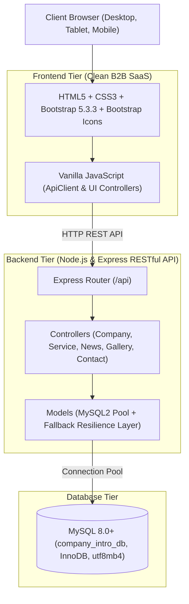

# WEBSITE GIỚI THIỆU DOANH NGHIỆP — CÔNG TY TNHH CÔNG NGHỆ FFT VIỆT NAM

> **Đề tài tốt nghiệp / Báo cáo thực tập doanh nghiệp (8 Tuần: 15/06/2026 – 09/08/2026)**  
> **Đơn vị thực tập:** CÔNG TY TNHH CÔNG NGHỆ FFT VIỆT NAM  
> **Người hướng dẫn:** Trương Thị Minh — Quản lý  
> **Phong cách thiết kế:** Enterprise B2B SaaS (Tối giản, chuyên nghiệp, mật độ thông tin cao, Anti-AI Slop)

---

## 📌 1. TỔNG QUAN DỰ ÁN

Dự án xây dựng cổng thông tin điện tử và hệ thống giới thiệu năng lực toàn diện cho **CÔNG TY TNHH CÔNG NGHỆ FFT VIỆT NAM**, phục vụ mục tiêu tiếp cận khách hàng doanh nghiệp, quảng bá giải pháp phần mềm/chuyển đổi số, tiếp nhận thông tin tư vấn tự động và cung cấp cổng quản trị dữ liệu tập trung.

### Các trang chức năng chính:
- **Trang chủ (`frontend/index.html`):** Hero banner, thông số ấn tượng, tóm tắt 3 năng lực cốt lõi, dịch vụ nổi bật, tin tức sự kiện, CTA chuyển đổi.
- **Giới thiệu (`frontend/pages/about/index.html`):** Lịch sử hình thành, sứ mệnh, tầm nhìn, 4 giá trị cốt lõi, đội ngũ ban lãnh đạo & kỹ sư.
- **Dịch vụ (`frontend/pages/services/index.html`):** Danh mục 6 dịch vụ CNTT chính, quy trình làm việc 4 bước chuẩn mực, modal xem chi tiết.
- **Tin tức (`frontend/pages/news/index.html`):** Tin hoạt động công ty, góc nhìn chuyên môn, bài viết tiêu điểm, sidebar tin xem nhiều.
- **Thư viện ảnh (`frontend/pages/gallery/index.html`):** Bộ sưu tập hình ảnh không gian làm việc, hoạt động team building, hội thảo; bộ lọc danh mục và lightbox phóng to ảnh.
- **Liên hệ (`frontend/pages/contact/index.html`):** Bản đồ, thông tin trụ sở, form tiếp nhận thông tin tư vấn trực tuyến (có cơ chế thẩm định dữ liệu chặt chẽ và khử mã độc XSS).
- **Cổng Quản trị Admin (`frontend/pages/admin/index.html`):** Bảng điều khiển theo dõi KPI liên hệ, lọc theo trạng thái (`unread`, `read`, `replied`), xem chi tiết nội dung và đổi trạng thái phản hồi.

---

## 🛠️ 2. NGĂN XẾP CÔNG NGHỆ (TECH STACK)



- **Frontend:** HTML5, CSS3, Bootstrap 5.3.3, Bootstrap Icons 1.11.3, Vanilla JavaScript (ES6+).
- **Backend:** Node.js (v20+ / v25+), Express.js 4.21+, CORS, dotenv, mysql2/promise.
- **Cơ sở dữ liệu:** MySQL 8.0+ (`company_intro_db`, InnoDB, `utf8mb4_unicode_ci`).
- **Đặc tính nổi bật:** Tích hợp tầng dự phòng dữ liệu tự động (`fallbackData.js`), cam kết không phát sinh lỗi 500 ngay cả khi CSDL ngoại tuyến.

---

## 🚀 3. HƯỚNG DẪN CÀI ĐẶT & KHỞI CHẠY (QUICK START)

### 3.1. Yêu cầu môi trường
- **Node.js:** Phiên bản 18.x trở lên (khuyên dùng Node.js 20+ hoặc 25+).
- **MySQL:** Phiên bản 8.0 trở lên đang chạy trên cổng mặc định 3306.
- **Trình duyệt:** Chrome, Edge, Firefox hoặc Safari bản mới nhất.

### 3.2. Cấu hình biến môi trường
Kiểm tra file cấu hình tại `backend/.env`:
```env
PORT=5000
DB_HOST=localhost
DB_PORT=3306
DB_USER=root
DB_PASSWORD=
DB_NAME=company_intro_db
CLIENT_URL=*
```

### 3.3. Cài đặt thư viện & Khởi tạo CSDL
```bash
# 1. Điều hướng vào thư mục backend và cài đặt dependencies
cd backend
npm install

# 2. Khởi tạo Cơ sở dữ liệu và nạp dữ liệu mẫu (Seed Data)
npm run db:init

# 3. Khởi chạy máy chủ Backend API
npm start
# Máy chủ sẽ lắng nghe tại: http://localhost:5000
# Health check endpoint:   http://localhost:5000/api/health
```

### 3.4. Trải nghiệm Website
- Mở file `frontend/index.html` trực tiếp trên trình duyệt hoặc sử dụng extension Live Server (VS Code / WebStorm).
- Truy cập trang Quản trị viên tại: `frontend/pages/admin/index.html`.

---

## 🧪 4. BỘ KIỂM THỬ TỰ ĐỘNG (AUTOMATED TEST SUITE)

Dự án cung cấp bộ công cụ kiểm thử tự động toàn diện được tích hợp sẵn qua npm scripts:

| Lệnh thực thi | Phân hệ kiểm thử | Mô tả chi tiết |
| :--- | :--- | :--- |
| `npm run test:contact` | Xử lý liên hệ & Sanitization | Kiểm tra thẩm định form, làm sạch XSS và vòng đời chuyển đổi trạng thái liên hệ. |
| `npm run test:functional` | Kiểm thử chức năng | Thực thi tự động 26 ca kiểm thử bao quát toàn bộ 7 trang giao diện và API endpoints. |
| `npm run test:ui` | Giao diện & Responsive | Kiểm tra 24 tiêu chí co giãn màn hình, thẻ Viewport, Grid system và tương thích trình duyệt. |
| `npm run test:regression` | Kiểm thử hồi quy | Chạy toàn diện 4 bộ test, khẳng định **Zero Regressions** (Không lỗi hồi quy). |
| `npm run test:audit` | Kiểm toán hệ thống | Đối chiếu ma trận truy vết yêu cầu (Traceability Audit 100%), kiểm toán hồ sơ kỹ thuật. |

---

## 📁 5. CẤU TRÚC THƯ MỤC DỰ ÁN

```text
PJ_THUE/
├── backend/                  # Mã nguồn máy chủ Node.js & Express API
│   ├── src/
│   │   ├── config/           # Cấu hình kết nối MySQL pool
│   │   ├── controllers/      # Bộ điều khiển xử lý nghiệp vụ (MVC)
│   │   ├── middlewares/      # Xử lý CORS, lỗi tập trung và 404
│   │   ├── models/           # Mô hình thao tác dữ liệu & Fallback layer
│   │   ├── routes/           # Định tuyến RESTful API endpoints
│   │   └── scripts/          # Bộ kịch bản kiểm thử tự động hóa
│   ├── package.json          # Danh mục thư viện và scripts
│   └── server.js             # Điểm khởi chạy ứng dụng
├── database/                 # Hồ sơ cơ sở dữ liệu MySQL
│   ├── schema.sql            # Kịch bản tạo cấu trúc 6 bảng CSDL InnoDB
│   ├── seed.sql              # Kịch bản nạp dữ liệu mẫu thực tế
│   └── initDb.js             # Script khởi tạo CSDL tự động qua Node.js
├── docs/                     # Toàn bộ 24 tài liệu kỹ thuật của dự án (Tuần 1 - 8)
│   └── README.md             # Chỉ mục tra cứu tài liệu kỹ thuật
├── frontend/                 # Giao diện người dùng & Trang quản trị
│   ├── assets/               # CSS, JS, hình ảnh biểu tượng
│   │   ├── css/style.css     # Định kiểu chuẩn Enterprise B2B SaaS
│   │   └── js/main.js        # Module ApiClient và tiện ích frontend
│   ├── pages/                # Các trang chức năng con
│   │   ├── about/            # Trang Giới thiệu
│   │   ├── admin/            # Cổng Quản trị Admin Portal
│   │   ├── contact/          # Trang Liên hệ & Form tư vấn
│   │   ├── gallery/          # Trang Thư viện hình ảnh
│   │   ├── news/             # Trang Tin tức & Sự kiện
│   │   └── services/         # Trang Dịch vụ & Giải pháp
│   └── index.html            # Trang chủ chính thức
└── README.md                 # Tài liệu hướng dẫn tổng quan dự án
```

---

## 📄 6. GIẤY PHÉP & BẢN QUYỀN

- **Đơn vị sở hữu:** CÔNG TY TNHH CÔNG NGHỆ FFT VIỆT NAM.  
- **Bản quyền © 2026.** Dự án phục vụ mục đích nghiên cứu, học tập và nghiệm thu thực tập doanh nghiệp.
