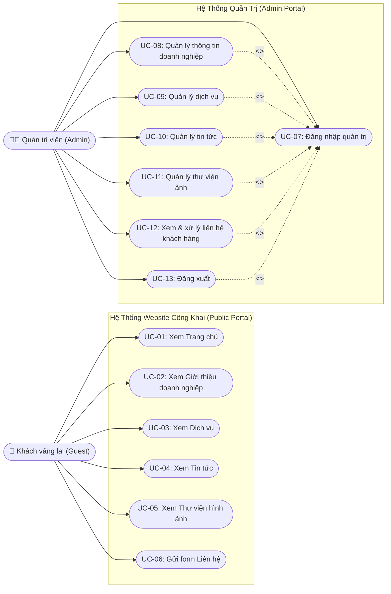

# TÀI LIỆU USE CASE DIAGRAM VÀ MÔ TẢ CHỨC NĂNG (STORY-004)

> **Mã công việc:** STORY-004  
> **Thuộc Epic:** EPIC-002 — Phân tích và thiết kế hệ thống  
> **Căn cứ kế hoạch:** [PROJECT_PLAN_Web_gioi_thieu_doanh_nghiep_OKL.md](../PROJECT_PLAN_Web_gioi_thieu_doanh_nghiep_OKL.md)  
> **Đáp ứng các yêu cầu:** REQ-F-004, REQ-F-006, AC-002  
> **Thời gian thực hiện (Tuần 3):** 29/06/2026 – 05/07/2026  
> **Đơn vị thực tập:** CÔNG TY TNHH CÔNG NGHỆ FFT VIỆT NAM  

---

## 1. TỔNG QUAN

Tài liệu này xác định các tác nhân (Actors), danh mục Use Case tổng thể, mô hình hóa tương tác giữa tác nhân và hệ thống bằng **Use Case Diagram**, đồng thời đặc tả chi tiết các Use Case chính của **Website giới thiệu doanh nghiệp**.

---

## 2. XÁC ĐỊNH TÁC NHÂN (ACTORS)

| Ký hiệu | Tác nhân (Actor) | Phân loại | Mô tả |
|:---:|---|:---:|---|
| **ACT-01** | **Khách vãng lai (Guest)** | Người dùng ngoài | Người dùng truy cập Internet, tìm hiểu hồ sơ năng lực, dịch vụ, tin tức công ty và có nhu cầu gửi biểu mẫu liên hệ/tư vấn. |
| **ACT-02** | **Quản trị viên (Admin)** | Người dùng trong | Nhân sự quản lý của doanh nghiệp, có tài khoản định danh để cập nhật nội dung website và theo dõi liên hệ khách hàng. |

---

## 3. DANH MỤC CÁC USE CASE

### 3.1. Phân hệ Người dùng công khai (Public Portal)
* **UC-01:** Xem thông tin trang chủ (Home overview)
* **UC-02:** Xem thông tin giới thiệu doanh nghiệp (Lịch sử, tầm nhìn, sứ mệnh)
* **UC-03:** Xem danh sách & chi tiết dịch vụ
* **UC-04:** Xem tin tức & sự kiện
* **UC-05:** Xem thư viện hình ảnh hoạt động (Gallery)
* **UC-06:** Gửi thông tin liên hệ / yêu cầu tư vấn

### 3.2. Phân hệ Quản trị hệ thống (Admin Portal)
* **UC-07:** Đăng nhập hệ thống quản trị
* **UC-08:** Quản lý thông tin doanh nghiệp (Company Info)
* **UC-09:** Quản lý dịch vụ (Thêm, sửa, xóa dịch vụ)
* **UC-10:** Quản lý tin tức (Thêm, sửa, xóa bài viết)
* **UC-11:** Quản lý thư viện hình ảnh (Thêm, xóa ảnh)
* **UC-12:** Xem và cập nhật trạng thái liên hệ của khách hàng
* **UC-13:** Đăng xuất tài khoản

---

## 4. SƠ ĐỒ USE CASE TỔNG THỂ (USE CASE DIAGRAM)

---

## 5. ĐẶC TẢ CHI TIẾT CÁC USE CASE CHÍNH

### 5.1. Đặc tả UC-06: Gửi thông tin liên hệ / phản hồi
* **Mã Use Case:** UC-06
* **Tên Use Case:** Gửi thông tin liên hệ
* **Tác nhân:** Khách vãng lai (Guest)
* **Mục tiêu:** Khách hàng gửi lời nhắn, yêu cầu báo giá hoặc tư vấn dịch vụ đến doanh nghiệp qua form trực tuyến.
* **Tiền điều kiện (Pre-conditions):** Khách hàng đang ở trang Liên hệ hoặc form liên hệ tại chân trang.
* **Hậu điều kiện (Post-conditions):** Thông tin được lưu vào bảng `contacts` trong CSDL với trạng thái `unread`; khách nhận được thông báo gửi thành công.
* **Luồng sự kiện chính (Main Flow):**
  1. Khách hàng truy cập trang Liên hệ.
  2. Hệ thống hiển thị form nhập gồm: Họ và tên, Email, Số điện thoại, Tiêu đề, Nội dung tin nhắn.
  3. Khách hàng điền thông tin và nhấn nút "Gửi liên hệ".
  4. Hệ thống kiểm tra dữ liệu đầu vào (tính hợp lệ của email, các trường bắt buộc không để trống).
  5. Hệ thống gửi yêu cầu HTTP POST đến Backend API `/api/contacts`.
  6. Backend kiểm tra tính toàn vẹn và ghi bản ghi vào CSDL MySQL.
  7. Hệ thống thông báo: *"Cảm ơn quý khách! Thông tin liên hệ đã được gửi thành công. Chúng tôi sẽ phản hồi sớm nhất."*
  8. Hệ thống tự động xóa trắng form nhập (reset form).
* **Luồng ngoại lệ (Alternative / Exception Flows):**
  - *4a. Dữ liệu không hợp lệ:* Nếu để trống trường bắt buộc hoặc email sai định dạng, hệ thống hiển thị cảnh báo lỗi màu đỏ ngay dưới ô nhập và không gửi dữ liệu.
  - *6a. Lỗi kết nối CSDL hoặc server:* Hệ thống thông báo lỗi: *"Có lỗi xảy ra trong quá trình gửi tin nhắn, vui lòng thử lại sau hoặc liên hệ hotline."*

---

### 5.2. Đặc tả UC-07: Đăng nhập quản trị
* **Mã Use Case:** UC-07
* **Tên Use Case:** Đăng nhập hệ thống quản trị
* **Tác nhân:** Quản trị viên (Admin)
* **Tiền điều kiện:** Quản trị viên đã có tài khoản được cấp trong bảng `users`.
* **Hậu điều kiện:** Quản trị viên vào giao diện Dashboard và được phép thao tác các chức năng quản trị.
* **Luồng sự kiện chính (Main Flow):**
  1. Quản trị viên truy cập đường dẫn đăng nhập quản trị.
  2. Hệ thống hiển thị form đăng nhập (Tên đăng nhập và Mật khẩu).
  3. Quản trị viên nhập thông tin xác thực và bấm "Đăng nhập".
  4. Hệ thống gửi thông tin đến Backend để kiểm tra đối chiếu trong CSDL.
  5. Backend xác nhận thông tin chính xác và trả về kết quả đăng nhập thành công.
  6. Hệ thống chuyển hướng Quản trị viên vào trang tổng quan quản trị (Admin Dashboard).
* **Luồng ngoại lệ (Alternative Flows):**
  - *5a. Sai thông tin đăng nhập:* Hệ thống hiển thị thông báo lỗi: *"Tên đăng nhập hoặc mật khẩu không chính xác."* Yêu cầu nhập lại.

---

### 5.3. Đặc tả UC-12: Xem và cập nhật trạng thái liên hệ
* **Mã Use Case:** UC-12
* **Tên Use Case:** Xem và cập nhật trạng thái liên hệ
* **Tác nhân:** Quản trị viên (Admin)
* **Tiền điều kiện:** Quản trị viên đã đăng nhập thành công (Thỏa mãn UC-07).
* **Hậu điều kiện:** Trạng thái xử lý của liên hệ được cập nhật trong CSDL (`unread` -> `read` / `replied`).
* **Luồng sự kiện chính (Main Flow):**
  1. Quản trị viên chọn mục "Quản lý liên hệ" từ menu quản trị.
  2. Hệ thống gửi yêu cầu GET tới API và hiển thị danh sách các liên hệ (Họ tên, email, ngày gửi, trạng thái).
  3. Quản trị viên bấm xem chi tiết một tin nhắn liên hệ.
  4. Hệ thống hiển thị toàn bộ nội dung và tự động đánh dấu trạng thái sang `read` (Đã đọc).
  5. Quản trị viên có thể chuyển trạng thái sang `replied` (Đã phản hồi) sau khi đã liên hệ lại với khách.
* **Luồng ngoại lệ:**
  - Danh sách liên hệ trống: Hệ thống hiển thị thông báo *"Chưa có liên hệ nào từ khách hàng."*

---

### 5.4. Đặc tả UC-03: Xem danh sách & chi tiết dịch vụ
* **Mã Use Case:** UC-03
* **Tên Use Case:** Xem dịch vụ doanh nghiệp
* **Tác nhân:** Khách vãng lai (Guest)
* **Tiền điều kiện:** Không có.
* **Hậu điều kiện:** Khách hàng nắm bắt được các giải pháp, dịch vụ mà doanh nghiệp cung cấp.
* **Luồng sự kiện chính (Main Flow):**
  1. Khách hàng chọn menu "Dịch vụ" trên thanh điều hướng.
  2. Hệ thống tải và hiển thị danh sách các dịch vụ dạng thẻ lưới (Tiêu đề, icon, mô tả ngắn).
  3. Khách hàng nhấn "Xem chi tiết" của một dịch vụ cụ thể.
  4. Hệ thống hiển thị thông tin đầy đủ về dịch vụ đó kèm nút "Liên hệ tư vấn dịch vụ này".

---

## 6. KẾT LUẬN VÀ BƯỚC TIẾP THEO

- Tài liệu Use Case Diagram và mô tả chức năng đã hoàn thành 100% mục tiêu của **STORY-004**, bao phủ đầy đủ các chức năng in-scope trong kế hoạch đề tài.
- Đầu vào này sẵn sàng cho **STORY-005: Xây dựng Activity Diagram** mô hình hóa các luồng xử lý nghiệp vụ tuần tự.
