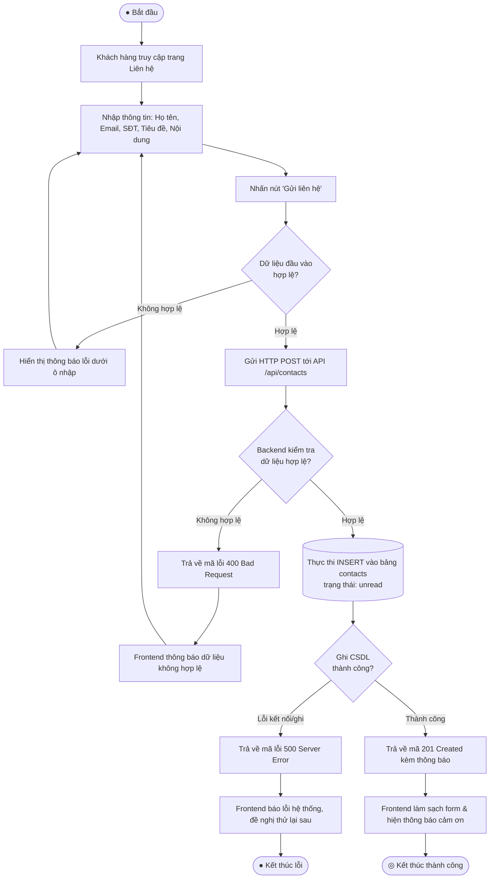
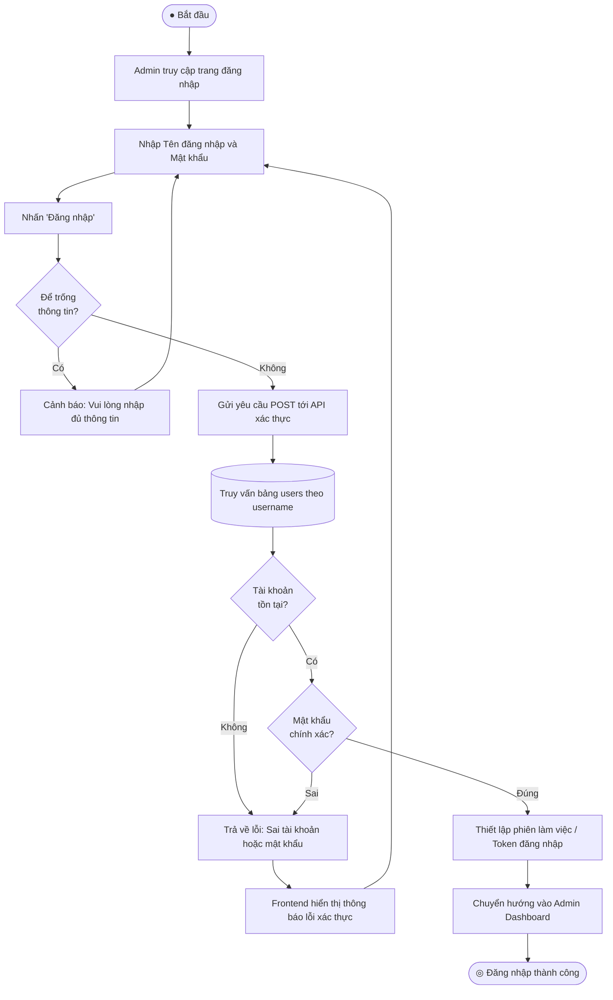
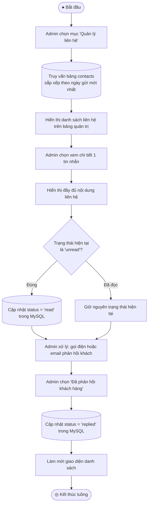
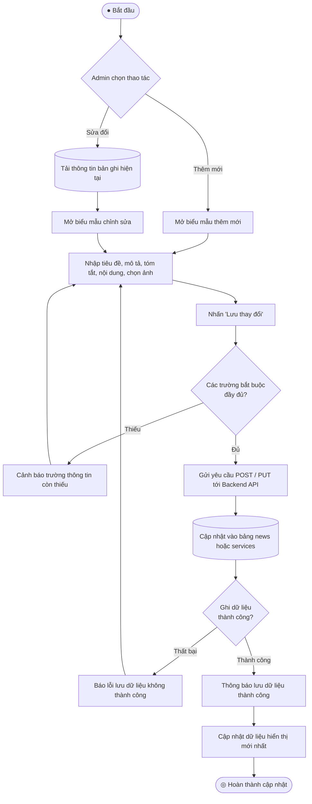

# TÀI LIỆU ACTIVITY DIAGRAM — PHÂN TÍCH LUỒNG XỬ LÝ NGHIỆP VỤ (STORY-005)

> **Mã công việc:** STORY-005  
> **Thuộc Epic:** EPIC-002 — Phân tích và thiết kế hệ thống  
> **Căn cứ kế hoạch:** [PROJECT_PLAN_Web_gioi_thieu_doanh_nghiep_OKL.md](../PROJECT_PLAN_Web_gioi_thieu_doanh_nghiep_OKL.md)  
> **Đáp ứng các yêu cầu:** REQ-F-007, AC-002  
> **Thời gian thực hiện (Tuần 4):** 06/07/2026 – 12/07/2026  
> **Đơn vị thực tập:** CÔNG TY TNHH CÔNG NGHỆ FFT VIỆT NAM  

---

## 1. TỔNG QUAN

Tài liệu này mô hình hóa tuần tự các luồng nghiệp vụ cốt lõi của **Website giới thiệu doanh nghiệp** bằng các sơ đồ hoạt động (**Activity Diagram**). Qua đó làm rõ sự tương tác giữa Người dùng (Frontend), Tầng xử lý nghiệp vụ (Backend) và Cơ sở dữ liệu (MySQL).

---

## 2. DANH MỤC CÁC LUỒNG HOẠT ĐỘNG CHÍNH

1. **Luồng 1:** Gửi thông tin liên hệ và yêu cầu tư vấn (Khách vãng lai ➔ Website ➔ CSDL).
2. **Luồng 2:** Xác thực và đăng nhập quản trị viên (Admin ➔ Backend ➔ CSDL).
3. **Luồng 3:** Xem và cập nhật trạng thái liên hệ của khách hàng (Admin Portal).
4. **Luồng 4:** Quản lý và cập nhật nội dung (Dịch vụ / Tin tức).

---

## 3. SƠ ĐỒ HOẠT ĐỘNG CHI TIẾT (ACTIVITY DIAGRAMS)

### 3.1. Luồng 1: Gửi thông tin liên hệ / phản hồi từ khách hàng

Luồng này mô tả quá trình khách truy cập điền và gửi form liên hệ, hệ thống xác thực tính hợp lệ dữ liệu và lưu trữ an toàn vào CSDL.

---

### 3.2. Luồng 2: Xác thực và đăng nhập quản trị viên

Mô tả luồng kiểm tra tài khoản, xác thực thông tin đăng nhập của Admin trước khi cấp quyền thao tác trên trang quản trị.

---

### 3.3. Luồng 3: Xem và cập nhật trạng thái liên hệ (Admin Contact Management)

Mô tả quy trình Quản trị viên theo dõi thông tin khách hàng gửi về và cập nhật tiến trình xử lý liên hệ.

---

### 3.4. Luồng 4: Cập nhật nội dung Dịch vụ / Tin tức

Mô tả quá trình Quản trị viên thêm mới hoặc hiệu chỉnh các bài viết tin tức, gói dịch vụ phục vụ hiển thị trên Website.

---

## 4. ĐỐI CHIẾU NGHIỆP VỤ & KẾT LUẬN

* Các sơ đồ Activity Diagram trên đã bao phủ trọn vẹn các luồng tương tác 2 chiều giữa Người dùng, Hệ thống Web và Cơ sở dữ liệu.
* Toàn bộ các nhánh rẽ điều kiện (Decision Nodes) và các kịch bản ngoại lệ (Exception flows) đều được xác định rõ ràng, đảm bảo hệ thống không xảy ra hiện tượng treo hoặc thiếu phản hồi cho người dùng.
* Tài liệu này là căn cứ trực tiếp để thiết kế cấu trúc dữ liệu chi tiết trong **STORY-006 (Database Design)** và xây dựng các hàm Controller/Route trong Backend.
