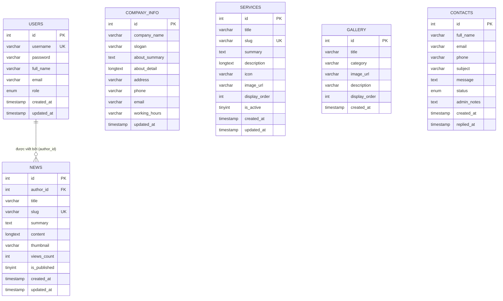

# TÀI LIỆU THIẾT KẾ CƠ SỞ DỮ LIỆU — DATABASE DESIGN (STORY-006)

> **Mã công việc:** STORY-006  
> **Thuộc Epic:** EPIC-002 — Phân tích và thiết kế hệ thống  
> **Căn cứ kế hoạch:** [PROJECT_PLAN_Web_gioi_thieu_doanh_nghiep_OKL.md](../PROJECT_PLAN_Web_gioi_thieu_doanh_nghiep_OKL.md)  
> **Đáp ứng các yêu cầu:** REQ-F-008, AC-002, Giải quyết triệt để các câu hỏi mở Q-003, Q-004  
> **Thời gian thực hiện (Tuần 3 & 4):** 29/06/2026 – 12/07/2026  
> **Hệ quản trị CSDL:** MySQL 8.0+ / MariaDB (Storage Engine: InnoDB, Charset: utf8mb4)  
> **Đơn vị thực tập:** CÔNG TY TNHH CÔNG NGHỆ FFT VIỆT NAM  

---

## 1. MỤC TIÊU VÀ NGUYÊN TẮC THIẾT KẾ

Tài liệu này xác định chi tiết cấu trúc cơ sở dữ liệu cho hệ thống **Website giới thiệu doanh nghiệp**. Thiết kế giải quyết toàn bộ các điểm chưa rõ (`TBD`) ghi nhận trong giai đoạn Foundation, đảm bảo:
* **Chuẩn hóa dữ liệu (Normal Forms):** Đạt chuẩn 3NF (Third Normal Form), tránh trùng lặp dữ liệu không cần thiết.
* **Tính toàn vẹn tham chiếu (Referential Integrity):** Sử dụng các ràng buộc khóa chính (`PRIMARY KEY`), khóa ngoại (`FOREIGN KEY`) và khóa duy nhất (`UNIQUE`).
* **Hỗ trợ tiếng Việt hoàn hảo:** Sử dụng bảng mã `utf8mb4` và collation `utf8mb4_unicode_ci`.
* **Hiệu năng truy vấn:** Tạo Index trên các trường tìm kiếm/lọc thường xuyên như `slug`, `status`, `created_at`.

---

## 2. SƠ ĐỒ THỰC THỂ LIÊN KẾT (ERD — ENTITY RELATIONSHIP DIAGRAM)

---

## 3. TỪ ĐIỂN DỮ LIỆU CHI TIẾT (DATA DICTIONARY)

### 3.1. Bảng `users` (Tài khoản quản trị hệ thống)
* **Mô tả:** Lưu trữ tài khoản định danh của ban quản trị để đăng nhập và quản lý website.

| Tên trường | Kiểu dữ liệu | Ràng buộc | Giá trị mặc định | Giải thích nghiệp vụ |
|---|---|---|---|---|
| `id` | `INT` | PK, AUTO_INCREMENT | - | Mã định danh duy nhất của người dùng |
| `username` | `VARCHAR(50)` | NOT NULL, UNIQUE | - | Tên đăng nhập hệ thống |
| `password` | `VARCHAR(255)` | NOT NULL | - | Mật khẩu tài khoản (lưu trữ hash an toàn) |
| `full_name` | `VARCHAR(100)` | NOT NULL | - | Họ và tên đầy đủ |
| `email` | `VARCHAR(100)` | NULL | NULL | Địa chỉ email liên hệ quản trị |
| `role` | `ENUM('admin', 'editor')` | NOT NULL | `'admin'` | Phân quyền vai trò người dùng |
| `created_at`| `TIMESTAMP` | NOT NULL | `CURRENT_TIMESTAMP` | Thời điểm tạo tài khoản |
| `updated_at`| `TIMESTAMP` | NOT NULL | `CURRENT_TIMESTAMP ON UPDATE` | Thời điểm cập nhật thông tin gần nhất |

---

### 3.2. Bảng `company_info` (Hồ sơ giới thiệu doanh nghiệp)
* **Mô tả:** Chứa thông tin nhận diện chính thức, lịch sử, sứ mệnh và kênh liên hệ của doanh nghiệp.

| Tên trường | Kiểu dữ liệu | Ràng buộc | Giá trị mặc định | Giải thích nghiệp vụ |
|---|---|---|---|---|
| `id` | `INT` | PK, AUTO_INCREMENT | - | Mã định danh thông tin (luôn duy trì record id = 1) |
| `company_name` | `VARCHAR(255)` | NOT NULL | - | Tên đầy đủ của doanh nghiệp |
| `slogan` | `VARCHAR(255)` | NULL | NULL | Khẩu hiệu / Giá trị định hướng |
| `about_summary` | `TEXT` | NULL | NULL | Tóm tắt giới thiệu ngắn (hiển thị trang chủ) |
| `about_detail` | `LONGTEXT` | NULL | NULL | Giới thiệu chi tiết (lịch sử, tầm nhìn, sứ mệnh trang About) |
| `address` | `VARCHAR(255)` | NOT NULL | - | Địa chỉ trụ sở chính |
| `phone` | `VARCHAR(50)` | NOT NULL | - | Số điện thoại hotline |
| `email` | `VARCHAR(100)` | NOT NULL | - | Hòm thư điện tử liên hệ chính thức |
| `working_hours` | `VARCHAR(100)` | NULL | `'Thứ 2 - Thứ 6: 08:00 - 17:30'` | Thời gian làm việc |
| `updated_at` | `TIMESTAMP` | NOT NULL | `CURRENT_TIMESTAMP ON UPDATE` | Thời điểm cập nhật thông tin gần nhất |

---

### 3.3. Bảng `services` (Danh mục dịch vụ & giải pháp)
* **Mô tả:** Lưu trữ danh sách các gói dịch vụ doanh nghiệp cung cấp cho khách hàng.

| Tên trường | Kiểu dữ liệu | Ràng buộc | Giá trị mặc định | Giải thích nghiệp vụ |
|---|---|---|---|---|
| `id` | `INT` | PK, AUTO_INCREMENT | - | Mã dịch vụ |
| `title` | `VARCHAR(255)` | NOT NULL | - | Tên gói dịch vụ |
| `slug` | `VARCHAR(255)` | NOT NULL, UNIQUE | - | Đường dẫn thân thiện SEO (vd: `tu-van-giai-phap-cntt`) |
| `summary` | `TEXT` | NULL | NULL | Mô tả tóm tắt (hiển thị thẻ card) |
| `description` | `LONGTEXT` | NULL | NULL | Chi tiết dịch vụ, quy trình thực hiện |
| `icon` | `VARCHAR(100)` | NULL | `'bi-briefcase'` | Mã icon Bootstrap hiển thị |
| `image_url` | `VARCHAR(255)` | NULL | NULL | Hình ảnh minh họa cho dịch vụ |
| `display_order` | `INT` | NOT NULL | `0` | Thứ tự ưu tiên sắp xếp hiển thị |
| `is_active` | `TINYINT(1)` | NOT NULL | `1` | Trạng thái hoạt động (1: Bật, 0: Tạm ẩn) |
| `created_at` | `TIMESTAMP` | NOT NULL | `CURRENT_TIMESTAMP` | Ngày tạo |
| `updated_at` | `TIMESTAMP` | NOT NULL | `CURRENT_TIMESTAMP ON UPDATE` | Ngày sửa gần nhất |

---

### 3.4. Bảng `news` (Tin tức, bài viết & sự kiện)
* **Mô tả:** Quản lý các bài viết tin tức, sự kiện và bài chia sẻ chuyên môn của doanh nghiệp.

| Tên trường | Kiểu dữ liệu | Ràng buộc | Giá trị mặc định | Giải thích nghiệp vụ |
|---|---|---|---|---|
| `id` | `INT` | PK, AUTO_INCREMENT | - | Mã bài viết |
| `author_id` | `INT` | FK -> `users(id)`, NULL | NULL | Tác giả bài viết |
| `title` | `VARCHAR(255)` | NOT NULL | - | Tiêu đề bài viết |
| `slug` | `VARCHAR(255)` | NOT NULL, UNIQUE | - | Đường dẫn SEO (vd: `khoi-dong-du-an-website`) |
| `summary` | `TEXT` | NOT NULL | - | Tóm tắt ngắn mở đầu bài viết |
| `content` | `LONGTEXT` | NOT NULL | - | Nội dung đầy đủ của bài viết |
| `thumbnail` | `VARCHAR(255)` | NULL | NULL | Tên tệp ảnh đại diện |
| `views_count` | `INT` | NOT NULL | `0` | Số lượt xem bài viết |
| `is_published` | `TINYINT(1)` | NOT NULL | `1` | Trạng thái phát hành (1: Xuất bản, 0: Bản nháp) |
| `created_at` | `TIMESTAMP` | NOT NULL | `CURRENT_TIMESTAMP` | Ngày xuất bản |
| `updated_at` | `TIMESTAMP` | NOT NULL | `CURRENT_TIMESTAMP ON UPDATE` | Ngày cập nhật |

---

### 3.5. Bảng `gallery` (Thư viện hình ảnh hoạt động)
* **Mô tả:** Bộ sưu tập ảnh thực tế về văn phòng, con người, sự kiện của công ty.

| Tên trường | Kiểu dữ liệu | Ràng buộc | Giá trị mặc định | Giải thích nghiệp vụ |
|---|---|---|---|---|
| `id` | `INT` | PK, AUTO_INCREMENT | - | Mã hình ảnh |
| `title` | `VARCHAR(255)` | NOT NULL | - | Tiêu đề ảnh |
| `category` | `VARCHAR(100)` | NOT NULL | `'Hoạt động'` | Phân loại album: `Văn phòng`, `Hoạt động`, `Dự án`, `Sự kiện` |
| `image_url` | `VARCHAR(255)` | NOT NULL | - | Đường dẫn file ảnh |
| `description` | `VARCHAR(500)` | NULL | NULL | Chú thích ngắn bức ảnh |
| `display_order` | `INT` | NOT NULL | `0` | Thứ tự sắp xếp |
| `created_at` | `TIMESTAMP` | NOT NULL | `CURRENT_TIMESTAMP` | Ngày thêm ảnh |

---

### 3.6. Bảng `contacts` (Yêu cầu liên hệ & tư vấn từ khách hàng)
* **Mô tả:** Tiếp nhận và lưu trữ thông điệp của khách gửi qua website, hỗ trợ theo dõi tiến trình xử lý.

| Tên trường | Kiểu dữ liệu | Ràng buộc | Giá trị mặc định | Giải thích nghiệp vụ |
|---|---|---|---|---|
| `id` | `INT` | PK, AUTO_INCREMENT | - | Mã liên hệ |
| `full_name` | `VARCHAR(100)` | NOT NULL | - | Họ tên người gửi |
| `email` | `VARCHAR(100)` | NOT NULL | - | Email người gửi |
| `phone` | `VARCHAR(50)` | NULL | NULL | Số điện thoại |
| `subject` | `VARCHAR(255)` | NOT NULL | - | Chủ đề / Tiêu đề liên hệ |
| `message` | `TEXT` | NOT NULL | - | Nội dung chi tiết |
| `status` | `ENUM('unread', 'read', 'replied')` | NOT NULL | `'unread'` | Trạng thái xử lý tin nhắn |
| `admin_notes` | `TEXT` | NULL | NULL | Ghi chú xử lý nội bộ của Admin |
| `created_at` | `TIMESTAMP` | NOT NULL | `CURRENT_TIMESTAMP` | Thời điểm gửi |
| `replied_at` | `TIMESTAMP` | NULL | NULL | Thời điểm phản hồi khách |

---

## 4. GIẢI QUYẾT CÁC ĐIỂM TBD & CÂU HỎI MỞ (RESOLVED OPEN QUESTIONS)

1. **Q-003 — Cấu trúc cột và ràng buộc CSDL chi tiết:**
   - **Đã giải quyết:** Toàn bộ 6 bảng đã được chuẩn hóa đầy đủ kiểu dữ liệu, các ràng buộc `NOT NULL`, `UNIQUE (slug)`, `DEFAULT`, và khóa ngoại `author_id` liên kết `news` với `users`.
2. **Q-004 — Phân quyền chi tiết của Actor:**
   - **Đã giải quyết:** Phân định rõ ràng qua trường `role` (`admin`, `editor`) trong bảng `users` và trường `status` (`unread`, `read`, `replied`) để quản lý tiến trình tương tác khách hàng.
3. **Cập nhật mã nguồn SQL:**
   - File [database/schema.sql](../database/schema.sql) và [database/seed.sql](../database/seed.sql) được đồng bộ hóa trực tiếp theo chuẩn thiết kế này.
