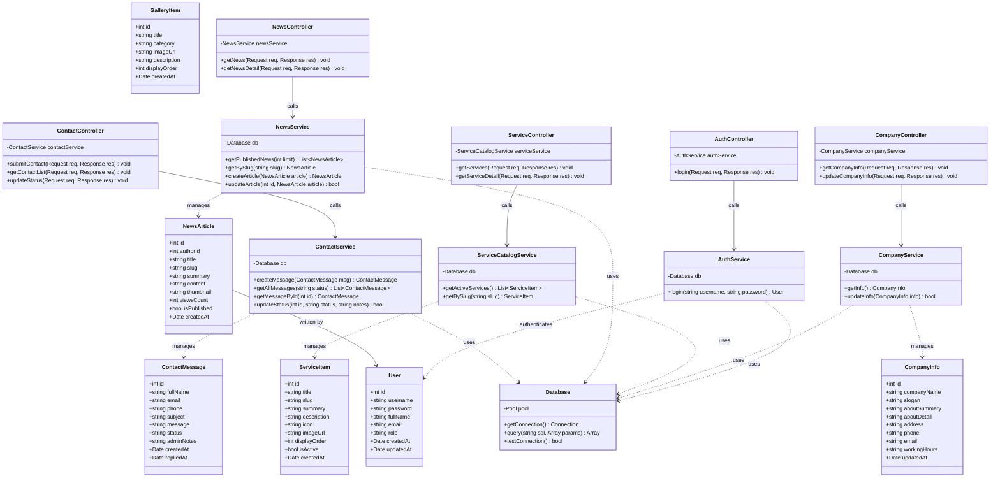

# TÀI LIỆU THIẾT KẾ CLASS DIAGRAM (STORY-007)

> **Mã công việc:** STORY-007  
> **Thuộc Epic:** EPIC-002 — Phân tích và thiết kế hệ thống  
> **Căn cứ kế hoạch:** [PROJECT_PLAN_Web_gioi_thieu_doanh_nghiep_OKL.md](../PROJECT_PLAN_Web_gioi_thieu_doanh_nghiep_OKL.md)  
> **Đáp ứng các yêu cầu:** REQ-F-009, AC-002, BR-002  
> **Thời gian thực hiện (Tuần 5):** 13/07/2026 – 19/07/2026  
> **Đơn vị thực tập:** CÔNG TY TNHH CÔNG NGHỆ FFT VIỆT NAM  

---

## 1. TỔNG QUAN

Tài liệu này mô hình hóa cấu trúc tĩnh hướng đối tượng của hệ thống Backend **Website giới thiệu doanh nghiệp** bằng sơ đồ lớp (**Class Diagram**). Thiết kế tuân thủ nguyên lý phân tầng (Layered Architecture): **Controller ➔ Service ➔ Model / Data Access ➔ Database**, bảo đảm tính module hóa cao, dễ kiểm thử và bám sát cấu trúc thư mục `backend/src/` đã khởi tạo.

---

## 2. KIẾN TRÚC PHÂN TẦNG VÀ PHÂN LOẠI CÁC LỚP

1. **Tầng Thực thể dữ liệu (Entity / Model Layer):**
   - Đại diện cho các đối tượng nghiệp vụ được ánh xạ từ các bảng trong CSDL MySQL (`User`, `CompanyInfo`, `ServiceItem`, `NewsArticle`, `GalleryItem`, `ContactMessage`).
2. **Tầng Truy xuất & Xử lý nghiệp vụ (Service / Data Access Layer):**
   - Chứa logic nghiệp vụ cốt lõi, tương tác với CSDL qua MySQL Pool (`Database`, `ContactService`, `NewsService`, `ServiceCatalogService`, `CompanyService`, `AuthService`).
3. **Tầng Điều khiển (Controller Layer):**
   - Tiếp nhận HTTP Request từ Client (Frontend), kiểm tra tính hợp lệ dữ liệu sơ bộ, điều phối Service thực thi và trả về HTTP Response chuẩn RESTful JSON (`ContactController`, `NewsController`, `ServiceController`, `CompanyController`, `AuthController`, `HealthController`).

---

## 3. SƠ ĐỒ LỚP CHI TIẾT (CLASS DIAGRAM)

---

## 4. ĐẶC TẢ CHI TIẾT CÁC PHƯƠNG THỨC NÒNG CỐT

### 4.1. `ContactService` & `ContactController`
- **Nghiệp vụ tiếp nhận liên hệ:**
  - `ContactController.submitContact(req, res)`: Tiếp nhận payload `{ fullName, email, phone, subject, message }`. Kiểm tra tính hợp lệ qua regex email và độ dài. Chuyển tiếp tới `ContactService.createMessage()`.
  - `ContactService.createMessage(msg)`: Thực thi câu lệnh `INSERT INTO contacts ...`, trả về đối tượng liên hệ vừa tạo kèm `id` và thời gian khởi tạo.
- **Nghiệp vụ xử lý liên hệ phía Admin:**
  - `ContactController.getContactList(req, res)`: Gọi `getAllMessages()` để lấy danh sách liên hệ theo thứ tự ngày mới nhất (`ORDER BY created_at DESC`).
  - `ContactController.updateStatus(req, res)`: Nhận `status` (`read` / `replied`) và `notes` để cập nhật trạng thái trong MySQL.

### 4.2. `NewsService` & `NewsController`
- `NewsController.getNews(req, res)`: Lấy danh sách tin tức đã xuất bản (`is_published = 1`) kèm phân trang hoặc giới hạn số lượng.
- `NewsController.getNewsDetail(req, res)`: Truy vấn tin tức theo đường dẫn thân thiện `slug`, tự động tăng số lượt xem (`views_count = views_count + 1`).

### 4.3. `Database` (Singleton Pool)
- Quản lý MySQL Connection Pool thông qua `mysql2/promise`.
- Cung cấp phương thức `query(sql, params)` dùng chung để đảm bảo kết nối được tự động giải phóng (release) về Pool sau khi truy vấn xong, tránh memory leak hoặc cạn kiệt connection.

---

## 5. ĐỐI CHIẾU VỚI MÃ NGUỒN TRIỂN KHAI THỰC TẾ (BR-002)

| Lớp trong thiết kế | File triển khai tương ứng trong mã nguồn |
|---|---|
| `Database` | [backend/src/config/db.js](../backend/src/config/db.js) |
| `ContactController` | `backend/src/controllers/contactController.js` (Triển khai ở EPIC-005) |
| `NewsController` | `backend/src/controllers/newsController.js` (Triển khai ở EPIC-005) |
| `ServiceController` | `backend/src/controllers/serviceController.js` (Triển khai ở EPIC-005) |
| `CompanyController` | `backend/src/controllers/companyController.js` (Triển khai ở EPIC-005) |
| `ContactService` | `backend/src/services/contactService.js` (Triển khai ở EPIC-005) |
| `NewsService` | `backend/src/services/newsService.js` (Triển khai ở EPIC-005) |

---

## 6. KẾT LUẬN & NGHIỆM THU EPIC-002

Với việc hoàn thành **STORY-007: Thiết kế Class Diagram**, toàn bộ các công việc trong **EPIC-002: Phân tích và thiết kế hệ thống** đã được thực hiện đầy đủ 100%:
* [x] **STORY-003:** Phân tích yêu cầu nghiệp vụ và đối tượng sử dụng.
* [x] **STORY-004:** Sơ đồ Use Case Diagram & mô tả chức năng chi tiết.
* [x] **STORY-005:** Sơ đồ Activity Diagram mô hình hóa các luồng nghiệp vụ.
* [x] **STORY-006:** Thiết kế CSDL chi tiết (ERD, Data Dictionary, chuẩn hóa schema & seed).
* [x] **STORY-007:** Thiết kế Class Diagram kiến trúc phân tầng.

Hệ thống đã sẵn sàng bước sang giai đoạn lập trình và xây dựng sản phẩm: **EPIC-003 (Xây dựng CSDL)** và **EPIC-004 (Xây dựng website)**.
