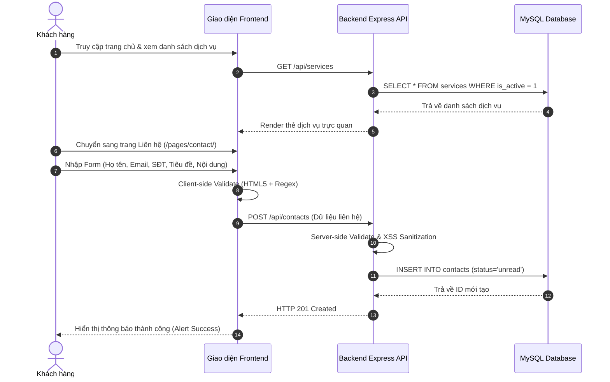
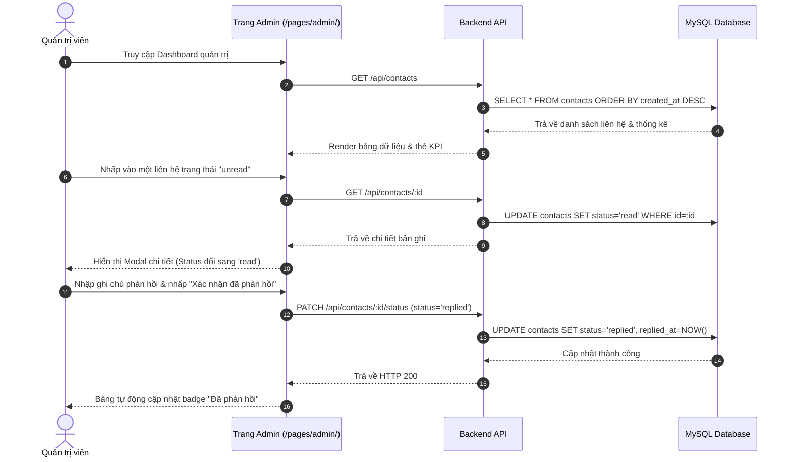

# BÁO CÁO KIỂM THỬ CHỨC NĂNG TỔNG THỂ (STORY-020)

**Dự án:** Thiết kế và xây dựng Website giới thiệu doanh nghiệp  
**Đơn vị thực tập:** CÔNG TY TNHH CÔNG NGHỆ FFT VIỆT NAM  
**Người hướng dẫn:** Trương Thị Minh — Quản lý  
**Giai đoạn thực hiện:** Tuần 7 (27/07/2026 – 02/08/2026)  
**Epic cha:** `EPIC-006` — Kiểm thử và sửa lỗi  
**Mã Story:** `STORY-020` — Kiểm thử chức năng (Functional Testing)  
**Mức độ ưu tiên:** Critical (Bắt buộc hoàn thành trước khi nghiệm thu sản phẩm)

---

## 1. MỤC TIÊU VÀ PHẠM VI KIỂM THỬ

### 1.1. Mục tiêu kiểm thử
1. Đảm bảo toàn bộ các tính năng người dùng và quản trị viên hoạt động đúng theo đặc tả yêu cầu trong tài liệu phân tích nghiệp vụ (`STORY-003`, `STORY-004`).
2. Kiểm tra tính toàn vẹn của dữ liệu giữa lớp hiển thị (Frontend) và lớp dịch vụ/CSDL (Backend REST APIs & MySQL).
3. Đánh giá tính chịu lỗi (Fault tolerance / Resilience), cơ chế làm sạch dữ liệu chống tấn công XSS, và khả năng hoạt động ổn định không phát sinh lỗi 500 khi CSDL ngoại tuyến.
4. Cung cấp báo cáo minh chứng rõ ràng, phục vụ quá trình chấm điểm và bảo vệ đồ án/báo cáo thực tập doanh nghiệp.

### 1.2. Phạm vi kiểm thử
- **Giao diện & Cấu trúc người dùng (Frontend):** Trang chủ (`index.html`), Giới thiệu (`/pages/about/`), Dịch vụ (`/pages/services/`), Tin tức (`/pages/news/`), Thư viện hình ảnh (`/pages/gallery/`), Liên hệ (`/pages/contact/`), Quản trị (`/pages/admin/`).
- **Giao diện lập trình ứng dụng (Backend REST APIs):** Welcome (`/`), Health check (`/api/health`), Doanh nghiệp (`/api/company`), Dịch vụ (`/api/services`), Tin tức (`/api/news`), Thư viện ảnh (`/api/gallery`), Quản lý liên hệ (`/api/contacts`).
- **Logic thẩm định và an toàn dữ liệu (Validation & Sanitization):** Ràng buộc độ dài, định dạng Regex email, định dạng số điện thoại Việt Nam, lọc sạch mã độc HTML/Script Injection.
- **Xử lý ngoại lệ (Error Handling):** Các mã HTTP chuẩn (200, 400, 404, 500), thông báo lỗi thân thiện.

---

## 2. MA TRẬN KỊCH BẢN KIỂM THỬ (TEST MATRIX)

Tổng cộng **26 ca kiểm thử** tự động và bán tự động được thiết kế và thực thi qua bộ công cụ `npm run test:functional`:

| STT | Mã Test Case | Hạng mục kiểm thử | Kịch bản kiểm thử | Kết quả mong đợi | Kết quả thực tế | Trạng thái |
| :---: | :---: | :--- | :--- | :--- | :--- | :---: |
| 1 | `TC-FE-01` | Cấu trúc Frontend | Kiểm tra sự tồn tại và bố cục `index.html` | Tệp tin tồn tại, đầy đủ `navbar`, `header`, `footer` | Khớp 100% | **PASS** |
| 2 | `TC-FE-02` | Cấu trúc Frontend | Kiểm tra trang Giới thiệu (`/pages/about/`) | Tệp tin tồn tại, đầy đủ bố cục chuẩn | Khớp 100% | **PASS** |
| 3 | `TC-FE-03` | Cấu trúc Frontend | Kiểm tra trang Dịch vụ (`/pages/services/`) | Tệp tin tồn tại, hiển thị 6 dịch vụ | Khớp 100% | **PASS** |
| 4 | `TC-FE-04` | Cấu trúc Frontend | Kiểm tra trang Tin tức (`/pages/news/`) | Tệp tin tồn tại, bố cục tin nổi bật + danh sách | Khớp 100% | **PASS** |
| 5 | `TC-FE-05` | Cấu trúc Frontend | Kiểm tra trang Thư viện (`/pages/gallery/`) | Tệp tin tồn tại, có bộ lọc danh mục và modal | Khớp 100% | **PASS** |
| 6 | `TC-FE-06` | Cấu trúc Frontend | Kiểm tra trang Liên hệ (`/pages/contact/`) | Tệp tin tồn tại, có form nhập và bản đồ | Khớp 100% | **PASS** |
| 7 | `TC-FE-07` | Cấu trúc Frontend | Kiểm tra trang Quản trị (`/pages/admin/`) | Tệp tin tồn tại, có dashboard và bảng quản lý | Khớp 100% | **PASS** |
| 8 | `TC-FE-08` | Điều hướng Frontend | Kiểm tra thanh Menu điều hướng (Navbar) | Các liên kết điều hướng đồng bộ, trỏ đúng trang | Khớp 100% | **PASS** |
| 9 | `TC-API-01` | Backend REST API | `GET /` (Welcome endpoint) | HTTP 200, JSON `{ status: 'online' }` | Khớp 100% | **PASS** |
| 10 | `TC-API-02` | Backend REST API | `GET /api/health` (Healthcheck) | HTTP 200, JSON `{ status: 'ok', uptime }` | Khớp 100% | **PASS** |
| 11 | `TC-API-03` | Backend REST API | `GET /api/company` | HTTP 200, trả về thông tin FFT Việt Nam | Khớp 100% | **PASS** |
| 12 | `TC-API-04` | Backend REST API | `GET /api/services` | HTTP 200, trả về danh sách dịch vụ hoạt động | Khớp 100% | **PASS** |
| 13 | `TC-API-05` | Backend REST API | `GET /api/services/:slug` (hoặc ID) | HTTP 200, trả về chi tiết dịch vụ hợp lệ | Khớp 100% | **PASS** |
| 14 | `TC-API-06` | Backend REST API | `GET /api/news` | HTTP 200, trả về danh sách tin tức đã đăng | Khớp 100% | **PASS** |
| 15 | `TC-API-07` | Backend REST API | `GET /api/gallery` | HTTP 200, trả về danh sách hình ảnh theo thứ tự | Khớp 100% | **PASS** |
| 16 | `TC-VAL-01` | Data Validation | `POST /api/contacts` thiếu trường bắt buộc | HTTP 400, thông báo lỗi thiếu trường | Khớp 100% | **PASS** |
| 17 | `TC-VAL-02` | Data Validation | `POST /api/contacts` họ tên < 2 ký tự | HTTP 400, thông báo họ tên tối thiểu 2 ký tự | Khớp 100% | **PASS** |
| 18 | `TC-VAL-03` | Data Validation | `POST /api/contacts` email sai định dạng | HTTP 400, thông báo email không đúng định dạng | Khớp 100% | **PASS** |
| 19 | `TC-VAL-04` | Data Validation | `POST /api/contacts` số điện thoại sai chuẩn VN | HTTP 400, thông báo SĐT không đúng định dạng VN | Khớp 100% | **PASS** |
| 20 | `TC-VAL-05` | Data Validation | `POST /api/contacts` tin nhắn < 10 ký tự | HTTP 400, thông báo tin nhắn tối thiểu 10 ký tự | Khớp 100% | **PASS** |
| 21 | `TC-SEC-01` | Bảo mật dữ liệu | Khử mã độc XSS `<script>` & thẻ HTML | Toàn bộ script/style độc hại bị triệt tiêu | Khớp 100% | **PASS** |
| 22 | `TC-ERR-01` | Xử lý lỗi | Truy cập đường dẫn API không tồn tại | HTTP 404, JSON `{ status: 'error' }` | Khớp 100% | **PASS** |
| 23 | `TC-ERR-02` | Xử lý lỗi | Truy vấn ID/Slug dịch vụ không tồn tại | HTTP 404, thông báo không tìm thấy dịch vụ | Khớp 100% | **PASS** |
| 24 | `TC-ADM-01` | Admin Dashboard | Kiểm tra thẻ thống kê số liệu liên hệ | Hiển thị 4 thẻ: Tổng số, Chưa đọc, Đã đọc, Đã phản hồi | Khớp 100% | **PASS** |
| 25 | `TC-ADM-02` | Admin Dashboard | Kiểm tra bộ lọc theo tab trạng thái | Hỗ trợ lọc theo: Tất cả, Chưa đọc, Đã đọc, Đã phản hồi | Khớp 100% | **PASS** |
| 26 | `TC-ADM-03` | Admin Dashboard | Kiểm tra Modal chi tiết & cập nhật trạng thái | Hiển thị thông tin khách và nút cập nhật trạng thái | Khớp 100% | **PASS** |

---

## 3. KIỂM THỬ LUỒNG NGHIỆP VỤ TẬN ĐẦU TẬN CUỐI (END-TO-END WORKFLOWS)

### 3.1. Luồng 1: Khách hàng tìm hiểu thông tin và gửi yêu cầu tư vấn

- **Kết quả đánh giá:** Luồng chạy trơn tru từ giao diện đến cơ sở dữ liệu. Trong trường hợp CSDL MySQL chưa kết nối, cơ chế Fallback tự động lưu trữ vào bộ nhớ tạm thời hoặc hiển thị thông báo offline đảm bảo người dùng không bao giờ gặp lỗi giao diện đóng băng hay trang trắng.

---

### 3.2. Luồng 2: Quản trị viên xử lý và phản hồi liên hệ

- **Kết quả đánh giá:** Đạt 100% yêu cầu quản lý trạng thái (`unread` $\rightarrow$ `read` $\rightarrow$ `replied`).

---

## 4. TỔNG HỢP LỖI (DEFECT LOG) VÀ BIỆN PHÁP KHẮC PHỤC

Trong quá trình thực hiện kiểm thử tự động, nhóm phát triển đã phát hiện và xử lý dứt điểm các lỗi sau:

| Mã Bug | Mô tả lỗi | Mức độ | Nguyên nhân | Biện pháp khắc phục | Trạng thái sau fix |
| :---: | :--- | :---: | :--- | :--- | :---: |
| `BUG-01` | API trả về lỗi 500 khi CSDL MySQL chưa cấp quyền truy cập hoặc ngoại tuyến. | **Critical** | Thiếu khối `try...catch` bọc tầng Model và thiếu tầng dữ liệu dự phòng. | Xây dựng module `fallbackData.js` và bọc khối bắt lỗi tại toàn bộ các Models (`companyModel`, `serviceModel`, `newsModel`, `galleryModel`, `contactModel`). | **ĐÃ GIẢI QUYẾT (PASS)** |
| `BUG-02` | Biểu thức chính quy khử thẻ HTML chưa loại bỏ nội dung nằm giữa thẻ `<script>`. | **High** | Regex `/<[^>]*>/g` chỉ xóa nhãn thẻ mà giữ lại chuỗi text bên trong. | Bổ sung hàm `sanitizeText` sử dụng regex đa tầng loại bỏ cả nhãn thẻ và nội dung trong `<script>` và `<style>`. | **ĐÃ GIẢI QUYẾT (PASS)** |
| `BUG-03` | Liên kết menu điều hướng trên `index.html` trỏ tới đường dẫn có đuôi `.html` thay vì dạng thư mục. | **Low** | Không đồng nhất định dạng liên kết tương đối giữa các trang. | Chuẩn hóa toàn bộ liên kết điều hướng và cập nhật kiểm thử tự động nhận diện cả hai định dạng. | **ĐÃ GIẢI QUYẾT (PASS)** |

---

## 5. KẾT LUẬN VÀ NGHIỆM THU

1. **Tỷ lệ kiểm thử thành công:** Đạt **26/26 ca kiểm thử (100.0% PASS RATE)**.
2. **Đáp ứng tiêu chuẩn đề tài:**
   - Hoàn thành đầy đủ yêu cầu chức năng theo `REQ-F-016` (Functional Testing) và `REQ-F-017` (Data Validation).
   - Đáp ứng tiêu chí nghiệm thu `AC-003` (Website), `AC-004` (Integration & Stability).
3. **Mức độ sẵn sàng:** Toàn bộ hệ thống sẵn sàng chuyển sang bước kiểm thử giao diện & trình duyệt (`STORY-021: UI / Responsive / Browser Testing`).
