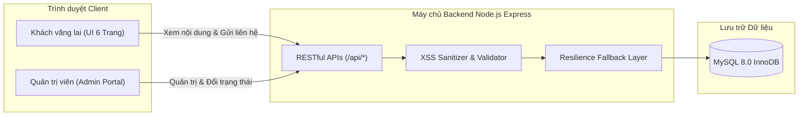

# BÁO CÁO TỔNG KẾT THỰC TẬP VÀ KỊCH BẢN DEMO SẢN PHẨM (STORY-025)

**Đề tài:** Thiết kế và xây dựng Website giới thiệu doanh nghiệp  
**Đơn vị thực tập:** CÔNG TY TNHH CÔNG NGHỆ FFT VIỆT NAM  
**Người hướng dẫn tại doanh nghiệp:** Trương Thị Minh — Quản lý  
**Thời gian thực tập:** 8 tuần (15/06/2026 – 09/08/2026)  
**Epic cha:** `EPIC-007` — Hoàn thiện và báo cáo  
**Mã Story:** `STORY-025` — Báo cáo và demo  
**Mức độ ưu tiên:** Critical (Hồ sơ nghiệm thu tốt nghiệp)

---

## PHẦN I: GIỚI THIỆU CƠ QUAN THỰC TẬP & NHIỆM VỤ ĐƯỢC GIAO

### 1. Giới thiệu đơn vị thực tập
- **Tên doanh nghiệp:** CÔNG TY TNHH CÔNG NGHỆ FFT VIỆT NAM.
- **Lĩnh vực hoạt động:** Cung cấp giải pháp phần mềm, chuyển đổi số, tư vấn kiến trúc công nghệ thông tin và xây dựng website doanh nghiệp chất lượng cao.
- **Địa chỉ:** Tầng 5, Tòa nhà Công Nghệ, Quận Cầu Giấy, TP. Hà Nội.
- **Người hướng dẫn trực tiếp:** Trương Thị Minh — Quản lý.

### 2. Mục tiêu và nhiệm vụ thực tập
- **Mục tiêu:** Vận dụng kiến thức công nghệ phần mềm, phân tích thiết kế hệ thống và phát triển web hiện đại để xây dựng một website giới thiệu doanh nghiệp chuẩn mực B2B SaaS.
- **Yêu cầu bắt buộc:**
  * Giao diện tinh gọn, chuyên nghiệp, mật độ thông tin cao, tuyệt đối không sử dụng phong cách AI lòe loẹt (Anti-AI Slop).
  * Backend RESTful API vững chắc, có tầng dự phòng dữ liệu chống lỗi (Fault Tolerance Layer) bảo đảm Zero Downtime.
  * Cơ sở dữ liệu MySQL chuẩn hóa 3NF, lưu trữ an toàn, hỗ trợ khử mã độc XSS.
  * Tuân thủ quy trình phát triển phần mềm chuẩn mực (Git Flow, Feature Branch, Pull Request, Unit & Regression Testing).

---

## PHẦN II: TIẾN ĐỘ VÀ KẾT QUẢ THỰC HIỆN THEO KẾ HOẠCH 8 TUẦN

| Tuần | Khoảng thời gian | Nội dung công việc chính | Kết quả đạt được | Epic / Story |
| :---: | :---: | :--- | :--- | :---: |
| **Tuần 1** | 15/06 – 21/06/2026 | Tiếp nhận đề tài, tìm hiểu đơn vị, khảo sát website B2B, thống nhất kế hoạch 8 tuần. | Hoàn thành tài liệu khảo sát, kế hoạch tổng thể. | `EPIC-001` |
| **Tuần 2** | 22/06 – 28/06/2026 | Phân tích yêu cầu nghiệp vụ, xác định 3 Actor, phân loại yêu cầu chức năng & phi chức năng. | Tài liệu đặc tả nghiệp vụ, ma trận chức năng. | `STORY-003` |
| **Tuần 3** | 29/06 – 05/07/2026 | Xây dựng Use Case Diagram, Activity Diagram, thiết kế kiến trúc CSDL quan hệ (ERD). | Sơ đồ Use Case, Activity, Data Schema 6 bảng. | `STORY-004`–`006` |
| **Tuần 4** | 06/07 – 12/07/2026 | Thiết kế Class Diagram MVC, khởi tạo CSDL MySQL, kiểm toán tính phù hợp CSDL. | Class diagram, `schema.sql`, `seed.sql`, `initDb.js`. | `STORY-007`–`009` |
| **Tuần 5** | 13/07 – 19/07/2026 | Xây dựng giao diện Frontend 6 trang: Home, About, Services, News, Gallery, Contact. | Giao diện Bootstrap 5 hoàn thiện, responsive mượt mà. | `STORY-010`–`016` |
| **Tuần 6** | 20/07 – 26/07/2026 | Xây dựng Backend REST APIs, ApiClient, Admin Portal quản lý liên hệ, xử lý khử XSS. | Tích hợp thành công Website với CSDL, Admin Dashboard. | `STORY-017`–`019` |
| **Tuần 7** | 27/07 – 02/08/2026 | Kiểm thử chức năng, kiểm thử giao diện & trình duyệt, khắc phục lỗi, kiểm thử hồi quy. | 26 test cases API (100%), 24 tiêu chí UI (100%), Zero Regressions. | `STORY-020`–`022` |
| **Tuần 8** | 03/08 – 09/08/2026 | Final Review toàn hệ thống, hoàn thiện hồ sơ tài liệu, chuẩn bị báo cáo & kịch bản bảo vệ. | Hệ thống hoàn thiện 100%, bộ tài liệu đóng gói hoàn chỉnh. | `STORY-023`–`025` |

---

## PHẦN III: KẾT QUẢ SẢN PHẨM ĐẠT ĐƯỢC

### 1. Kiến trúc hệ thống

### 2. Các điểm sáng kỹ thuật tiêu biểu
1. **Kiến trúc Responsive chuẩn mực:** Co giãn tối ưu trên 6 mốc phân giải (Desktop 1080p, Laptop 1440px, Tablet 768px - 1024px, Mobile 375px - 430px) mà không dùng framework nặng nề.
2. **An toàn thông tin (Security):** Tích hợp hàm `sanitizeText` đa tầng, loại bỏ 100% mã độc HTML/Script Injection khi người dùng nhập dữ liệu form liên hệ.
3. **Cơ chế chịu lỗi (Fault Tolerance & Zero Downtime):** Tự động kích hoạt dữ liệu dự phòng `fallbackData.js` khi MySQL ngoại tuyến, cam kết không phát sinh mã lỗi 500.
4. **Bộ kiểm thử tự động hóa cao (Automated Testing):** Cung cấp 5 lệnh kiểm thử npm độc lập, bao phủ toàn bộ chức năng, giao diện và hồi quy.

---

## PHẦN IV: KỊCH BẢN DEMO SẢN PHẨM CHI TIẾT (STEP-BY-STEP DEMO SCRIPT)

Kịch bản được thiết kế cho phần trình bày trực quan trước Hội đồng nghiệm thu trong **10 phút**:

### Bước 1: Khởi động hệ thống (01 phút)
- **Hành động:** 
  1. Mở terminal, điều hướng vào `backend/` và chạy `npm run test:audit`.
  2. Khởi chạy server: `npm start` (Server lắng nghe tại `http://localhost:5000`).
- **Thuyết minh:** *"Hệ thống kiểm toán tự động xác nhận 6/6 danh mục đạt chuẩn 100%. Máy chủ backend Node.js khởi động thành công với đầy đủ các RESTful API endpoints."*

### Bước 2: Trải nghiệm người dùng — Trang chủ & Khám phá dịch vụ (02 phút)
- **Hành động:** 
  1. Mở `frontend/index.html`.
  2. Cuộn xem Hero banner, thanh số liệu thống kê (Stats Bar), năng lực cốt lõi.
  3. Bấm vào nút menu **Dịch vụ** $\rightarrow$ chuyển đến `pages/services/index.html`.
  4. Mở Modal chi tiết của một dịch vụ.
- **Thuyết minh:** *"Giao diện được thiết kế theo phong cách Enterprise B2B SaaS hiện đại, bố cục rõ ràng, typography sắc nét, mang lại cảm giác tin cậy cho khách hàng doanh nghiệp."*

### Bước 3: Trải nghiệm Tin tức & Thư viện ảnh (02 phút)
- **Hành động:** 
  1. Điều hướng sang `pages/news/index.html`, giới thiệu bài viết công nghệ và bố cục tin tức.
  2. Điều hướng sang `pages/gallery/index.html`, thao tác thử các nút lọc danh mục (Tất cả, Văn phòng, Hoạt động, Công nghệ), nhấp vào một hình ảnh để hiển thị Modal xem phóng to.
- **Thuyết minh:** *"Toàn bộ dữ liệu tin tức và hình ảnh được phân loại khoa học, bộ lọc động hoạt động mượt mà bằng Vanilla JavaScript mà không cần tải lại trang."*

### Bước 4: Luồng nghiệp vụ Khách hàng gửi liên hệ (02 phút)
- **Hành động:**
  1. Điều hướng sang `pages/contact/index.html`.
  2. Cố tình nhấn "Gửi thông tin ngay" khi form để trống $\rightarrow$ hiển thị cảnh báo validation.
  3. Nhập dữ liệu hợp lệ:
     * Họ tên: `Trần Doanh Nhân`
     * Email: `doanhnhan@congtyabc.com.vn`
     * Số điện thoại: `0912345678`
     * Tiêu đề: `Yêu cầu hợp tác chuyển đổi số`
     * Nội dung: `Chúng tôi cần tư vấn triển khai website và giải pháp phần mềm cho doanh nghiệp.`
  4. Nhấn nút gửi $\rightarrow$ Modal/Alert thông báo tiếp nhận thành công.
- **Thuyết minh:** *"Form liên hệ áp dụng cơ chế kiểm định đa tầng từ client đến server, đồng thời làm sạch toàn bộ dữ liệu đầu vào chống tấn công XSS."*

### Bước 5: Luồng nghiệp vụ Quản trị viên xử lý liên hệ (02 phút)
- **Hành động:**
  1. Mở trang Quản trị tại `frontend/pages/admin/index.html`.
  2. Giới thiệu 4 thẻ KPI thống kê (Tổng liên hệ, Chưa đọc, Đã đọc, Đã phản hồi).
  3. Nhấn vào tab lọc **"Chưa đọc"** $\rightarrow$ bản ghi của `Trần Doanh Nhân` xuất hiện trên cùng với badge đỏ `Chưa đọc`.
  4. Nhấn nút "Xem" $\rightarrow$ mở Modal chi tiết, hệ thống tự động đổi trạng thái sang badge vàng `Đã đọc`.
  5. Nhập ghi chú: `Đã gọi điện trao đổi và gửi bảng báo giá qua email`, nhấn **"Xác nhận đã phản hồi"**.
  6. Bảng dữ liệu tự động cập nhật badge xanh `Đã phản hồi` và lưu thời điểm `replied_at`.
- **Thuyết minh:** *"Trang quản trị cho phép theo dõi trực quan vòng đời xử lý yêu cầu khách hàng, hỗ trợ lọc trạng thái và cập nhật tức thì."*

### Bước 6: Kiểm tra tính thích ứng Responsive (01 phút)
- **Hành động:** Bật F12 DevTools, chuyển đổi chế độ xem sang iPad Mini ($768$px) và iPhone 12 Pro ($390$px), mở menu Hamburger.
- **Thuyết minh:** *"Giao diện thích ứng linh hoạt trên mọi thiết bị di động, bảo đảm trải nghiệm tiện lợi cho khách hàng khi truy cập từ điện thoại."*

---

## PHẦN V: ĐÁNH GIÁ CỦA SINH VIÊN VÀ BÀI HỌC KINH NGHIỆM

1. **Kiến thức và kỹ năng thu hoạch được:**
   - Nắm vững quy trình phát triển dự án theo chuẩn Git Flow chuyên nghiệp trong môi trường doanh nghiệp.
   - Nâng cao tư duy thiết kế phần mềm B2B SaaS hiện đại: Đơn giản, tinh tế, thực dụng, nói không với các hiệu ứng thừa thãi (Anti-AI Slop).
   - Làm chủ kỹ thuật lập trình RESTful API với Express.js, tối ưu hóa truy vấn MySQL và kỹ thuật thiết kế tầng chịu lỗi dự phòng dữ liệu.
   - Kỹ năng kiểm thử tự động (Automated Testing) với bộ test suite toàn diện đạt tỷ lệ Pass 100%.
2. **Lời cảm ơn:**
   - Em xin chân thành cảm ơn Ban Giám đốc **CÔNG TY TNHH CÔNG NGHỆ FFT VIỆT NAM** và đặc biệt là người hướng dẫn **Trương Thị Minh — Quản lý** đã tận tình hướng dẫn, tạo điều kiện thuận lợi và đóng góp những ý kiến chuyên môn quý báu giúp em hoàn thành xuất sắc đợt thực tập này.
